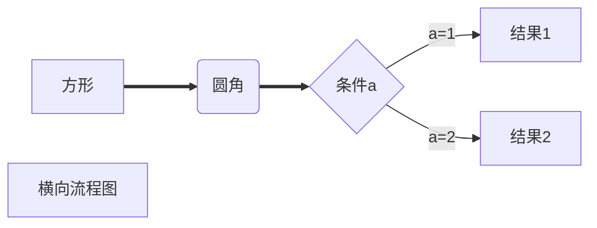

[TOC]

# markdown的使用说明

## 一、标题

```
# 这是一级标题
## 这是二级标题
```

## 二、段落

### 1、换行

这是第一行
这是第二行

这是第一段

这是第二段

### 2、分割线

---

```
---
```

## 三、文字显示

### 1、字体

```
**这是粗体**
~~这是删除线~~
<u>这是下划线</u>
*这是斜体*
==这是高亮==
```

**这是粗体**
~~这是删除线~~
<u>这是下划线</u>
*这是斜体*
==这是高亮==

### 2、上下标

局限性较大，只适用于比较简单的情况

```
x^2^
H~2~O
1\*2\*3\*...\*99
```

x^2^
H~2~O
1\*2\*3\*...\*99

## 四、列表

### 1、无序列表

```
*+空格
```

* 一级分类
	* 二级分类（tab键）
		* 三级分类（tab键）
	* 回到二级分类（ctrl+[）
		* 回到三级分类（crtl+]）
* 二级分类（enter键）

按两次回车键退出无需分类的状态

### 2、有序列表

```
数字+.+空格
```

1. 第一个
2. 第二个

### 3、任务列表

```
* [ ] 吃早餐
* [x] 背单词
```

* [ ] 吃早餐
* [x] 背单词

## 五、区块显示

```
>+回车
```

> 这是外层区块

> > 这是内层区块
>
> > > 这是最内层区块

## 六、代码显示

`int a=0`

```c++
//```+enter插入代码块

#include<iostream>
using namespace std;

int main(){
    cout<<"hello world"<<endl;
    return 0;
}
```


## 七、链接

```
www.baidu.com
[百度一下](https://www.baidu.com)
[百度一下](https://www.baidu.com "https://www.baidu.com")
```

www.baidu.com
[百度一下](https://www.baidu.com)
[百度一下](https://www.baidu.com "https://www.baidu.com")

## 八、脚注

```
[^文本]
[^文本]:解释说明
```

这是增加脚注的方法[^1]

[^1]:这是一段比较长的注释。<br>这是第二行

## 九、图片插入

```

快捷键Ctrl+Shift+I
```


## 十、表格

```
Ctrl+T
```

| 表头 |      |      |
| :--: | ---- | ---- |
|      |      |      |
|      |      |      |
|      |      |      |

## 十一、流程图

### 1、横向流程图

````

````


### 2、纵向流程图

## 十二、表情符号

```
编辑-表情与符号
快捷键-Windows+。
```

## 十三、数学公式

### 1、公式的插入

#### ①行中公式

```
$1+1=2$
```

$1+1=2$

#### ②独立公式

```
$$
1+1=2
$$
```

$$
1+1=2
$$

### 2、上下标

```
$x^{y^z}=(1+e^x)^(-2xy^w)$
$\sideset{^1_2}{^3_4}\underset{6}\bigotimes$
```

$x^{y^z}=(1+e^x)^(-2xy^w)$

### 3、括号和分隔符

```
$\langle\quad\rangle\quad\lceil\quad\rceil\quad\lfloor\quad\rfloor\quad\lbrace\quad\rbrace\quad\lvert\quad\rvert$
$f(x,y,z)=3y^2z\left(3+\dfrac{7x+5}{1+y^2}\right)$
$\left.\dfrac{\mathrm{d}u}{\mathrm{d}x}\right|_{x=0}$
```

$\langle\quad\rangle\quad\lceil\quad\rceil\quad\lfloor\quad\rfloor\quad\lbrace\quad\rbrace\quad\lvert\quad\rvert$

$f(x,y,z)=3y^2z\left(3+\dfrac{7x+5}{1+y^2}\right)$

$\left.\dfrac{\mathrm{d}u}{\mathrm{d}x}\right|_{x=0}$

### 4、分数

```
$\frac{a}{b}\quad\dfrac{a}{b}\quad{a\over b}$
```

$\frac{a}{b}\quad\dfrac{a}{b}\quad{a\over b}$

### 5、开方

```
$\sqrt[根指数，省略时为2]{被开方数}$
```

$\sqrt[3]{27}$

### 6、省略号

```
$\cdots\quad\ldots\quad\vdots\quad\ddots$
```

$\cdots\quad\ldots\quad\vdots\quad\ddots$

### 7、矢量和均值

```
$\overrightarrow{E(\vec{r})}\quad\overleftarrow{E(\vec{r})}\quad\overrightleftarrow{E(\vec{r})}\quad\underrightarrow{E(\vec{r})}\quad\underleftarrow{E(\vec{r})}\quad\underleftrightarrow{E(\vec{r})}\quad\overline{v}=\bar{v}\quad\underline{v}$
```

$\overrightarrow{E(\vec{r})}\quad\overleftarrow{E(\vec{r})}\quad\overleftrightarrow{E(\vec{r})}\quad\underrightarrow{E(\vec{r})}\quad\underleftarrow{E(\vec{r})}\quad\underleftrightarrow{E(\vec{r})}\quad\overline{v}=\bar{v}\quad\underline{v}$

### 8、积分

```
$$
\iint\limits_D\left(\dfrac{\partial Q}{\partial x}-\dfrac{\partial P}{\partial y}\right){\rm d}x{\rm d}y=\oint\limits_LP{\rm d}x+Q{\rm d}y
$$
```

$$
\iint\limits_D\left(\dfrac{\partial Q}{\partial x}-\dfrac{\partial P}{\partial y}\right){\rm d}x{\rm d}y=\oint\limits_LP{\rm d}x+Q{\rm d}y
$$

$$
\int_1^x
$$

### 9、极限

```
$\lim\limits_{n\to\infin}(1+\dfrac{1}{n})^n=e$
```

$\lim\limits_{n\to\infin}(1+\dfrac{1}{n})^n=e$

### 10、累加、累乘及交集、并集

```
$\sum\limits_{i=1}^n\dfrac{1}{n^2}\quad and\quad\prod\limits_{i=1}^n\dfrac{1}{n^2}\quad and\quad\bigcup\limits_{i=1}^n\dfrac{1}{n^2}\quad and\quad\bigcap\limits_{i=1}^n\dfrac{1}{n^2}$
```

$\sum\limits_{i=1}^n\dfrac{1}{n^2}\quad and\quad\prod\limits_{i=1}^n\dfrac{1}{n^2}\quad and\quad\bigcup\limits_{i=1}^n\dfrac{1}{n^2}\quad and\quad\bigcap\limits_{i=1}^n\dfrac{1}{n^2}$

### 11、希腊字母

| 语法                          | 字母                            | 语法                    | 字母                      | 语法               | 字母                 |
| ----------------------------- | ------------------------------- | ----------------------- | ------------------------- | ------------------ | -------------------- |
| \Alpha(\alpha)                | $\Alpha(\alpha)$                | \Beta(\beta)            | $\Beta(\beta)$            | \Gamma(\gamma)     | $\Gamma(\gamma)$     |
| \Epsilon(\epsilon)\varepsilon | $\Epsilon(\epsilon)\varepsilon$ | \Zeta(\zeta)            | $\Zeta(\zeta)$            | \Eta(\eta)         | $\Eta(\eta)$         |
| \Iota(iota)                   | $\Iota(iota)$                   | \Kappa(\kappa)\varkappa | $\Kappa(\kappa)\varkappa$ | \Lambda(\lambda)   | $\Lambda(\lambda)$   |
| \Nu(\nu)                      | $\Nu(\nu)$                      | \Xi(\xi)                | $\Xi(\xi)$                | \Omicron(\omicron) | $\Omicron(\omicron)$ |
| \Rho(\rho)\varrho             | $\Rho(\rho)\varrho$             | \Sigma(\sigma)\varsigma | $\Sigma(\sigma)\varsigma$ | \Tau(\tau)         | $\Tau(\tau)$         |
| \Phi(\phi)\varphi             | $\Phi(\phi)\varphi$             | \Chi(\chi)              | $\Chi(\chi)$              | \Psi(\psi)         | $\Psi(\psi)$         |
| \Delta(\delta)                | $\Delta(\delta)$                | \Theta(\theta)\vartheta | $\Theta(\theta)\vartheta$ | \Mu(\mu)           | $\Mu(\mu)$           |
| \Pi(\pi)\varpi                | $\Pi(\pi)\varpi$                | \Omega(\omega)          | $\Omega(\omega)$          | \upsilon           | $\upsilon$           |
| \ell                          | $\ell$                          | \eth                    | $\eth$                    | \hbar              | $\hbar$              |
| \hslash                       | $\hslash$                       | \mho                    | $\mho$                    | \partial           | $\partial$           |


### 12、特殊字符

#### ①说明

可以在字符前使用`\large`或者`\small`以显示更大或更小的字符

${\LARGE A}{\Large A}{\large A}A{\small A}$

#### ②关系运算符

| 1           | 2                   | 3            |
| ----------- | ------------------- | ------------ |
| $\pm(\mp)$  | $\times$            | $\div$       |
| $\bigodot$  | $\bigotimes$        | $\bigoplus$  |
| $\nmid$     | $\cdot$             | $\mid$       |
| $\ge$       | $\le$               | $\ll$        |
| $\geqslant$ | $\leqslant$         | $\neq$       |
| $\approx$   | $\xlongequal{text}$ | $\triangleq$ |
| $\sim$      | $\doteq$            | $\equiv$     |
| $\cong$     | $\propto$           | $\parallel$  |
| $\prec$     | $\pmod{2}$          | $\bmod{2}$   |

#### ③集合运算符

| 输入      | 显示        | 输入        | 显示          | 输入       | 显示         |
| --------- | ----------- | ----------- | ------------- | ---------- | ------------ |
| \emptyset | $\emptyset$ | \varnothing | $\varnothing$ |            |              |
| \subset   | $\subset$   | \subseteq   | $\subseteq$   | \subsetnq  | $\subsetneq$ |
| \supset   | $\supset$   | \supseteq   | $\supseteq$   | \supsetneq | $\supsetneq$ |
| \bigcap   | $\bigcap$   | \bigcup     | $\bigcup$     | \setminus  | $\setminus$  |
| \bigvee   | $\bigvee$   | \bigwedge   | $\bigwedge$   |            |              |
| \in       | $\in$       | \notin      | $\notin$      | \ni        | $\ni$        |

#### ④三角运算符

| 输入    | 显示      | 输入 | 显示   | 输入   | 显示     |
| ------- | --------- | ---- | ------ | ------ | -------- |
| \circ   | $\circ$   | \bot | $\bot$ | \angle | $\angle$ |
| \degree | $\degree$ |      |        |        |          |

#### ⑤微积分运算符

| 输入  | 显示    | 输入   | 显示     | 输入   | 显示     |
| ----- | ------- | ------ | -------- | ------ | -------- |
| \int  | $\int$  | \iint  | $\iint$  | \iiint | $\iiint$ |
| \oint | $\oint$ | \oiint | $\oiint$ | \prime | $\prime$ |
| \lim  | $\lim$  | \infin | $\infin$ | \nabla | $\nabla$ |
| \grad | $\grad$ |        |          |        |          |

#### ⑥逻辑运算符

| 输入     | 显示       | 输入       | 显示         | 输入   | 显示     |
| -------- | ---------- | ---------- | ------------ | ------ | -------- |
| \because | $\because$ | \therefore | $\therefore$ |        |          |
| \forall  | $\forall$  | \exist     | $\exist$     |        |          |
| \not>    | $\not>$    | \not<      | $\not<$      |        |          |
| \land    | $\land$    | \lor       | $\lor$       | \lnot  | $\lnot$  |
| \top     | $\top$     | \vdash     | $\vdash$     | \vDash | $\vDash$ |

#### ⑦带帽符号

| 输入           | 显示             | 输入            | 显示              |
| -------------- | ---------------- | --------------- | ----------------- |
| \hat{xy}       | $\hat{xy}$       | \widehat{xyz}   | $\widehat{xyz}$   |
| \tilde{xy}     | $\tilde{xy}$     | \widetilde{xyz} | $\widetilde{xyz}$ |
| \check{x}      | $\check{x}$      | \breve{y}       | $\breve{y}$       |
| \grave{x}      | $\grave{x}$      | \acute{y}       | $\acute{y}$       |
| \dot{x}        | $\dot{x}$        | \ddot{x}        | $\ddot{x}$        |
| \overparen{xy} | $\overparen{xy}$ |                 |                   |

#### ⑧选取符号

| 输入                           | 显示                             | 输入                             | 显示                              |
| ------------------------------ | -------------------------------- | -------------------------------- | --------------------------------- |
| \fbox{a+b+c+d}                 | $\fbox{a+b+c+d}$                 |                                  |                                   |
| \overbrace{xx\cdots x}^{10个x} | $\overbrace{xx\cdots x}^{10个x}$ | \underbrace{xx\cdots x}__{10个x} | $\underbrace{xx\cdots x}_{10个x}$ |

#### ⑨箭头符号

| 输入           | 显示             | 输入              | 显示                | 输入                | 显示                  |
| -------------- | ---------------- | ----------------- | ------------------- | ------------------- | --------------------- |
| \leftarrow     | $\leftarrow$     | \rightarrow       | $\rightarrow$       | \leftrightarrow     | $\leftrightarrow$     |
| \longleftarrow | $\longleftarrow$ | \longrightarrow   | $\longrightarrow$   | \longleftrightarrow | $\longleftrightarrow$ |
| \Leftarrow     | $\Leftarrow$     | \Rightarrow       | $\Rightarrow$       | \Leftrightarrow     | $\Leftrightarrow$     |
| \Longleftarrow | $\Longleftarrow$ | \Longrightarrow   | $\Longrightarrow$   | \Longleftrightarrow | $\Longleftrightarrow$ |
| \uparrow       | $\uparrow$       | \downarrow        | $\downarrow$        | \updownarrow        | $\updownarrow$        |
| \Uparrow       | $\Uparrow$       | \Downarrow        | $\Downarrow$        | \Updownarrow        | $\Updownarrow$        |
| \to            | $\to$            | \swarrow          | $\swarrow$          | \nearrow            | $\nearrow$            |
| \gets          | $\gets$          | \seaarrow         | $\searrow$          | \nwarrow            | $\nwarrow$            |
| \mapsto        | $\mapsto$        | \rightrightarrows | $\rightrightarrows$ | \leftleftarrows     | $\leftleftarrows$     |

#### ⑩空格

| 输入 | 效果   | 输入   | 效果   | 输入   | 效果       |
| ---- | ------ | ------ | ------ | ------ | ---------- |
| \!   | $|\!|$ | 默认   | $| |$  | \quad  | $|\quad|$  |
| \,   | $|\,|$ | \;(\ ) | $|\;|$ | \qquad | $|\qquad|$ |

### 13、字体

```
${\字体{需要转换的字符}}$
```

| 输入 | 说明     | 显示            | 输入  | 说明       | 显示              |
| ---- | -------- | --------------- | ----- | ---------- | ----------------- |
| \rm  | 罗马体   | ${\rm{TCMiBA}}$ | \cal  | 花体       | ${\cal{TCMiBA}}$  |
| \it  | 意大利体 | ${\it{TCMiBA}}$ | \Bbb  | 黑板粗体   | ${\Bbb{TCMiBA}}$  |
| \bf  | 粗体     | ${\bf{TCMiBA}}$ | \mit  | 数学斜体   | ${\mit{TCMiBA}}$  |
| \sf  | 等线体   | ${\sf{TCMiBA}}$ | \scr  | 手写体     | ${\scr{TCMiBA}}$  |
| \tt  | 打印字体 | ${\tt{TCMiBA}}$ | \frak | 旧德式字体 | ${\frak{TCMiBA}}$ |

### 14、大括号和行标

```
$$
f\left(
\left[
\dfrac{1+\{x,y\}}{\left(\dfrac{x}{y}+\dfrac{y}{x}\right)(u+1)}+a
\right]
^{\dfrac{3}{2}}
\right)
\tag{1}
$$
```

$$
f\left(
\left[
\dfrac{1+\{x,y\}}{\left(\dfrac{x}{y}+\dfrac{y}{x}\right)(u+1)}+a
\right]
^{\dfrac{3}{2}}
\right)
\tag{1}
$$

### 15、其他命令

#### ①注释文字

```
$\text{content}$
```

$\text{content}$

#### ②文字颜色

```
$\color{#rgb}{文字}$
```

| 输入 | 显示                   | 输入 | 显示                   | 输入 | 显示                   | 输入 | 显示                   |
| ---- | ---------------------- | ---- | ---------------------- | ---- | ---------------------- | ---- | ---------------------- |
| #050 | $\color{#050}{TCMiBA}$ | #055 | $\color{#055}{TCMiBA}$ | #05A | $\color{#05A}{TCMiBA}$ | #05F | $\color{#05F}{TCMiBA}$ |
| #A50 | $\color{#A50}{TCMiBA}$ | #A55 | $\color{#A55}{TCMiBA}$ | #A5A | $\color{#A5A}{TCMiBA}$ | #A5F | $\color{#A5F}{TCMiBA}$ |
| #0A0 | $\color{#0A0}{TCMiBA}$ | #0A5 | $\color{#0A5}{TCMiBA}$ | #0AA | $\color{#0AA}{TCMiBA}$ | #0AF | $\color{#0AF}{TCMiBA}$ |
| #AA0 | $\color{#AA0}{TCMiBA}$ | #AA5 | $\color{#AA5}{TCMiBA}$ | #AAA | $\color{#AAA}{TCMiBA}$ | #AAF | $\color{#AAF}{TCMiBA}$ |
| #0F0 | $\color{#0F0}{TCMiBA}$ | #0F5 | $\color{#0F5}{TCMiBA}$ | #0FA | $\color{#0FA}{TCMiBA}$ | #0FF | $\color{#0FF}{TCMiBA}$ |

#### ③删除线

```
$$
\require{cancel}\begin{array}{r1}
\verb|y+\cancel{x}|&y+\cancel{x}\\
\verb|y+\cancel{y+x}|&y+\cancel{y+x}\\
\verb|y+\bcancel{x}|&y+\bcancel{x}\\
\verb|y+\xcancel{x}|&y+\xcancel{x}\\
\verb|y+\cancelto{0}{x}|&y+\cancelto{0}{x}\\
\verb+\frac{1\cancel19}{\cancel95}=\frac15+&\frac{1\cancel19}{\cancel95}=\frac\\
\end{array}
$$
```

$$
\require{cancel}\begin{array}{r1}
\verb|y+\cancel{x}|&y+\cancel{x}\\
\verb|y+\cancel{y+x}|&y+\cancel{y+x}\\
\verb|y+\bcancel{x}|&y+\bcancel{x}\\
\verb|y+\xcancel{x}|&y+\xcancel{x}\\
\verb|y+\cancelto{0}{x}|&y+\cancelto{0}{x}\\
\verb+\frac{1\cancel19}{\cancel95}=\frac15+&\frac{1\cancel19}{\cancel95}=\frac15\\
\end{array}
$$

### 16、矩阵

#### ①无框矩阵

```
$$
\begin{matrix}
1&x&x^2\\
1&y&y^2\\
1&z&z^2
\end{matrix}
$$
```

$$
\begin{matrix}
1&x&x^2\\
1&y&y^2\\
1&z&z^2
\end{matrix}
$$

#### ②有框矩阵

| matrix                               | pmatrix                                | bmatrix                                | Bmatrix                                | vmatrix                                | Vmatrix                                |
| ------------------------------------ | -------------------------------------- | -------------------------------------- | -------------------------------------- | -------------------------------------- | -------------------------------------- |
| $\begin{matrix}1&2\\3&4\end{matrix}$ | $\begin{pmatrix}1&2\\3&4\end{pmatrix}$ | $\begin{bmatrix}1&2\\3&4\end{bmatrix}$ | $\begin{Bmatrix}1&2\\3&4\end{Bmatrix}$ | $\begin{vmatrix}1&2\\3&4\end{vmatrix}$ | $\begin{Vmatrix}1&2\\3&4\end{Vmatrix}$ |

#### ③带省略号的矩阵

```
$$
\begin{pmatrix}
1 & a_1 & a_1^2 & \cdots & a_1^n \\
1 & a_2 & a_2^2 & \cdots & a_2^n \\
\vdots & \vdots & \vdots & \ddots & \vdots \\
1 & a_m & a_m^2 & \cdots & a_m^n \\
\end{pmatrix}
$$
```

$$
\begin{pmatrix}
1 & a_1 & a_1^2 & \cdots & a_1^n \\
1 & a_2 & a_2^2 & \cdots & a_2^n \\
\vdots & \vdots & \vdots & \ddots & \vdots \\
1 & a_m & a_m^2 & \cdots & a_m^n \\
\end{pmatrix}
$$

#### ④带分割线的矩阵

```
$$
\left[
\begin{array}{cc|c}
1&2&3\\
4&5&6
\end{array}
\right]
$$
```

$$
\left[
\begin{array}{cc|c}
1&2&3\\
4&5&6
\end{array}
\right]
$$

$$
\begin{equation}
\left[
\begin{array}{cc|c}
1&2&3\\
4&5&6
\end{array}
\right]
\end{equation}
$$

#### ⑤行中矩阵

```
$\bigl(\begin{smallmatrix}a&b\\c&d\end{smallmatrix}\bigr)$
```

$\bigl(\begin{smallmatrix}a&b\\c&d\end{smallmatrix}\bigr)$

### 17、方程式序列

```
$$
\begin{align}
\sqrt{37}=\sqrt{\dfrac{73^2-1}{12^2}}\\
&=\sqrt{\dfrac{73^2}{12^2}\cdot\dfrac{73^2-1}{73^2}}\\
&=\sqrt{\dfrac{73^2}{12^2}}\sqrt{\dfrac{73^2-1}{73^2}}\notag\\
&=\dfrac{73}{12}\sqrt{1-\dfrac{1}{73^2}}\\
\approx\dfrac{73}{12}\left(1-\dfrac{1}{2\cdot73^2}\right)\label{A}
\end{align}
$$
***

$$
\begin{align*}
v+m&=0&\text{Given}\tag1\\
-w&=-w+0&\text{additive identify}\tag2\\
-w+0&=-w+(v+w)&\text{equations $(1)$ and $(2)$}
\end{align*}
$$
```

$$
\begin{align}
\sqrt{37}=\sqrt{\dfrac{73^2-1}{12^2}}\\
&=\sqrt{\dfrac{73^2}{12^2}\cdot\dfrac{73^2-1}{73^2}}\\
&=\sqrt{\dfrac{73^2}{12^2}}\sqrt{\dfrac{73^2-1}{73^2}}\notag\\
&=\dfrac{73}{12}\sqrt{1-\dfrac{1}{73^2}}\\
\approx\dfrac{73}{12}\left(1-\dfrac{1}{2\cdot73^2}\right)\label{A}
\end{align}
$$
***

$$
\begin{align*}
v+m&=0&\text{Given}\tag1\\
-w&=-w+0&\text{additive identify}\tag2\\
-w+0&=-w+(v+w)&\text{equations $(1)$ and $(2)$}
\end{align*}
$$

### 18、条件表达式

```
$$
f(n)=
\begin{cases}
n/2,&\text{if $n$ is even}\\
3n+1,&\text{if $n$ is odd}
\end{cases}
$$
```

$$
f(n)=
\begin{cases}
n/2,&\text{if $n$ is even}\\
3n+1,&\text{if $n$ is odd}
\end{cases}
$$

### 19、配置行高

```
$$
f(n)=
\begin{cases}
n/2,&\text{if $n$ is even}\\[2ex]
3n+1,&\text{if $n$ is odd}
\end{cases}\tag{适配[2ex]}
$$
```

$$
f(n)=
\begin{cases}
n/2,&\text{if $n$ is even}\\[2ex]
3n+1,&\text{if $n$ is odd}
\end{cases}\tag{适配[2ex]}
$$

### 20、数组与表格

```text
$$
\begin{array}{c|lcr}
n&\text{左对齐}\text{居中对齐}\text{右对齐}\\
\hline
1&4&7&9\\
2&5&8&7\\
3&1&2&9
\end{array}
$$
```

$$
\begin{array}{c|lcr}
n&\text{左对齐}&\text{居中对齐}&\text{右对齐}\\
\hline
1&4&7&9\\
2&5&8&7\\
3&1&2&9
\end{array}
$$

### 21、嵌套表格或数组


### 22、方程组

```
$$
\begin{cases}
a_1x+b_1y+c_1z=d_1\\
a_2x+b_2y+c_2z=d_2\\
a_3x+b_3y+c_3z=d_3\\
\end{cases}
$$
```

$$
\begin{cases}
a_1x+b_1y+c_1z=d_1\\
a_2x+b_2y+c_2z=d_2\\
a_3x+b_3y+c_3z=d_3\\
\end{cases}
$$
